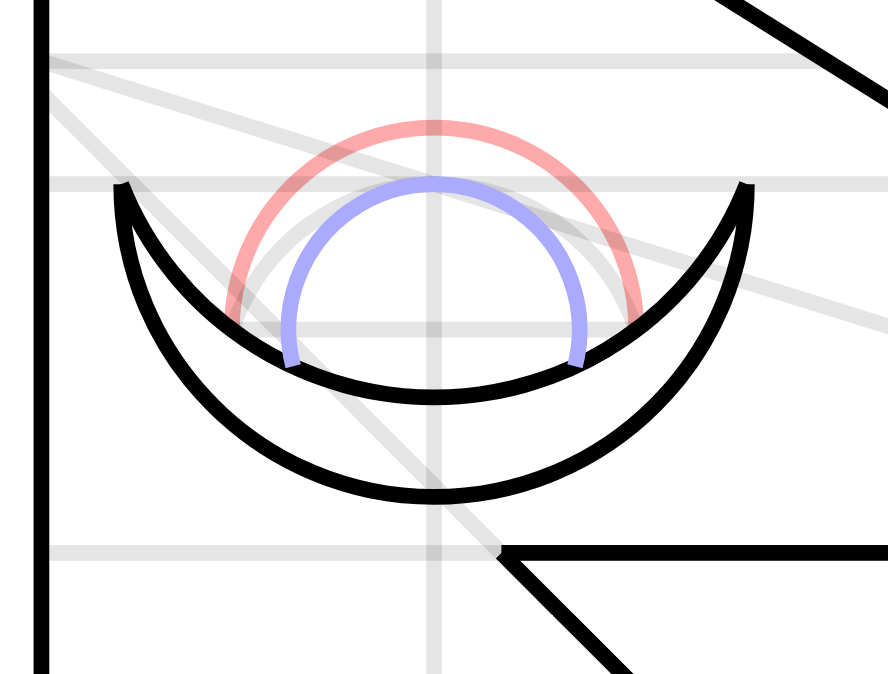

# Let's Play: Flag of Nepal

The flag of Nepal is notable for many reasons. One of them is that its compass-and-straightedge construction is laid out in the national constitution. Purely in text, no diagrams. And in two languages!

[This is an (in-progress!) walk-through of the flag's construction.](https://www.settinger.net/experiments/nepal-flag/) Click to advance the animation and display a new portion of the text description. If you find a mistake please let me know!

## I have some questions

My big question is this: *how should step (18) be interpreted?* That's the step for generating the rays of the moon.

> (18) Eight equal and similar triangles of the moon are to be made in the space lying inside the semi-circle of No. (16) and outside the arc of No. (17) of this Schedule.

Here I've highlighted the semicircle and arc in question:

The semicircle is in red, it is precisely 180°. The arc is in blue, it is approximately 209°. So if we are to create eight equal and similar triangles, should they span 180° or 209°? "Equal and similar" simply means the triangles are congruent, it says nothing about the angles or the lengths of any individual triangle. It doesn't even guarantee that the triangles are isosceles!

Is the Nepali version less ambiguous? That one says:

> (१८) यो अनुसूचीको नं (१६) को अर्ध वृत्ताकार भित्र र नं (१७) को वृत्त खण्ड बाहिर चन्द्रमाको आठवटाबराबरका कोण बनाउने ।

I don't speak Nepali, and I don't trust Google Translate to be accurate with regards to precise constructions. Do you know what it says?

I've identified three "reasonable" interpretations of step 18, shown here:

  

In the first one, each triangle spans 1/8 of the arc from step (17). If you look closely, there are tiny tiny crimson slivers between the crescent and the rays, which is kind of a bummer. I think this solution would be the best if not for that.

In the second one, each triangle spans 22.5°, 1/8 of the semicircle from step (16). Based on some brief Flickr browsing, this seems to be the most common flag variant in real life (i.e. not digital renderings).

In the third, each triangle spans 22.5° like before, but a ninth and tenth triangle have been added to cover the additional arc length. This is by far the most common digital version of the flag. This is the version one sees on Wikipedia. This is the version used in the Nepal constitution! But the instructions do make it clear that there are to be *eight* triangles, not ten. So...is this unconstitutional?

It's not a big deal, of course. If you search online you'll see plenty of Nepalese flags, flown by Nepalese officials, that skew pretty far from all of these interpretations. I rather like the ones where the moon looks like a lotus flower.

## AN UPDATE FROM A NEPALI SPEAKER

I dusted off my unused Reddit account just so I could post a request on the Vexillology and BadNepaliFlags subreddits. Three months later, I got this response from user hereforbeer98:

> Hi, I’m not sure if you figured this out yet but I speak Nepali and reviewed the document, it just says make 8 similar triangles. I believe the second interpretation is correct. Never paid much mind to it ever but then again we never had to draw an official flag by following the constitution.
> 
> For what it’s worth, the Nepali seal also has that version: https://thumbs.dreamstime.com/z/nepal-coat-arms-d-rendered-112301745.jpg
> 
> Glad to see your interest in this and lmk if you need help w anything else Nepali. Namaste!

Thank you very much to this user for confirming both versions of the constitution are equally ambiguous!

## External resources

* [Constitution of Nepal (English, PDF)](https://www.lawcommission.gov.np/en/wp-content/uploads/2021/01/Constitution-of-Nepal.pdf)
* [Constitution of Nepal (Nepali, PDF)](https://www.lawcommission.gov.np/np/wp-content/uploads/2021/01/%E0%A4%A8%E0%A5%87%E0%A4%AA%E0%A4%BE%E0%A4%B2%E0%A4%95%E0%A5%8B-%E0%A4%B8%E2%80%8C%E0%A4%82%E0%A4%B5%E0%A4%BF%E0%A4%A7%E0%A4%BE%E0%A4%A8.pdf)
* [Flag construction section of the Constitution of Nepal (Nepali, HTML)](https://www.lawcommission.gov.np/np/archives/1962)
* [Numberphile did a nice video on this flag construction many years ago](https://www.youtube.com/watch?v=f2Gne3UHKHs)

## """Cheat codes"""

If the animation is too slow for you, open a the developer console and type `sheet.speedmult=5`. You can play with existing points and line segments contained in the `geom` object; try writing things like `geom.AC.draw()` or `geom.M.fadeOut(0.9)`.
